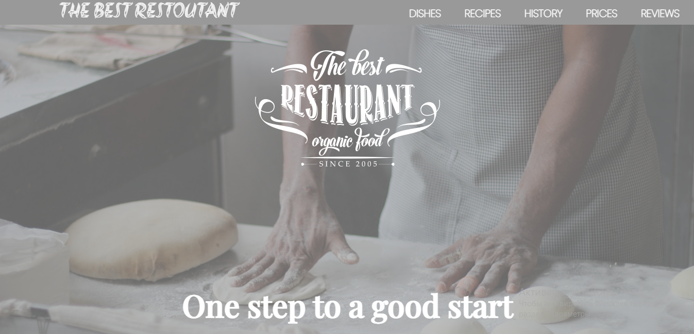

#🧾
##**This project is a team project, however number of team members maximum can be 3. The project weights 20 points. All team members will get the same grade. Grade will be calculated as average grade from all team members. Hence all team members should be ready for this project. 

Develop web site about Kazakhstan. For instance by your web site you can describe medicine, traditions, transport, sport, art in Kazakhstan. The project should satisfy following requirements:

1)Number of web pages must be at least 5.

2)The project must contain at least two flexbox containers with elements.

3)Some HTML elements in project must be aligned by bootstrap grid system.

4)In your project you should have at least five buttons and two tables. They should have bootstrap classes.

5)Colors should be defined by rgb, rgba, hsl, hsla functions and by hexadecimal numbers. 

6)Web pages must be mobile adaptable.

7)Push your work in github repository.

8)Explain your work(for 5 minutes for one team) by slides during the practice class.**

#📜
##*Проект 2 го казыр осы жерге ссылка жыберем макеттын 
"https://nicepage.com/ru/html-templates/preview/retsepty-i-uroki-kulinarii-148837?device=desktop" осы

<!-- Сурет керек тамактар казакыстанын и тагы рецепт Нуржан осыларды жасай аласын ба тагыосы жер де код бар сайттын Р=) -->
Мен орындап  койдым то есть сурет теп тауып кайдым енды 4 еу калды оган меню рецепт сондай жасау керек тагы аддапкалды
Тагы быр нарсе текст терды озгерту керек сол*

☕🤞🎶👀🐱‍👓🐱‍💻

